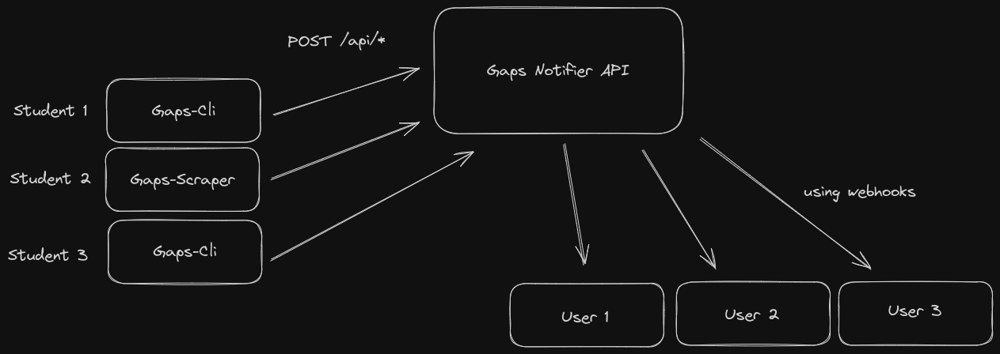

# Gaps Notifier API

## Introduction

- Gaps Notifier provides notifications to multiple users around [gaps](https://gaps.heig-vd.ch/)

## [Gaps](https://gaps.heig-vd.ch/)

- Gaps is an Academical Planning System

## Gaps Notifier

- This api is meant to notify users when events happen in gaps

- This api is run by users for users, which means that it can't notify anyone if no data is fed into it

- To automatize this data feeding, the [gaps-cli](https://github.com/heig-lherman/gaps-cli) or the [gaps-scraper](https://github.com/AndreCostaaa/gaps-scraper) can be used


_Main communication schema_

## Communication Sequence

### New Event

1. A new event is detected
2. A POST request is done to the REST API
3. The subscribers to this particular event are notified through webhooks

## Discord

- Integration with discord is very easily done since the gaps-notifier-api uses webhooks to notify users of events. Check this stackoverflow [thread](https://stackoverflow.com/questions/75305136/how-to-create-a-function-to-send-messages)

## Important - Usage Recommendation

- Since this application relies on information input from users to be useful, we highly recommend using the already hosted instance. This allows you to benefit from the collective contributions of all users, enhancing the utility and value of the application.

## API

- This application is currently being hosted by [Lutonite](https://github.com/Lutonite).

- If you wish to use it, please write me or [Lutonite](https://github.com/Lutonite) an email and we'll gladly create a user for you.

#### Retrieving an access token

<details>
 <summary><code>POST</code> <code><b>/api/token</b></code> <code>(Retrieves an access token)</code></summary>

##### Parameters

> | name | type     | data type   | description             |
> | ---- | -------- | ----------- | ----------------------- |
> | None | required | object JSON | `{ user_id: <user_id>}` |

##### Responses

> | http code | content-type       | response                                                                                                   |
> | --------- | ------------------ | ---------------------------------------------------------------------------------------------------------- |
> | `200`     | `application/json` | `{"access_token": <access_token>, "token_type": "Bearer", "expiration_timestamp": <expiration_timestamp>}` |
> | `404`     | `application/json` | `{"error":"Invalid User"}`                                                                                 |

##### Example cURL

> ```javascript
> curl -X POST -H "Content-Type: application/json" -d '{"user_id": <user_id>}' <url>/api/token
> ```

</details>

---

#### Subscribing

<details>
 <summary><code>POST</code> <code><b>/api/subscribe</b></code> <code>(Subscribes to one course)</code></summary>

##### Parameters

> | name | type     | data type   | description                                                                             |
> | ---- | -------- | ----------- | --------------------------------------------------------------------------------------- |
> | None | required | object JSON | `{"course": <course_name>, "class": <class_identifier>, "webhook_url": <webhook_url>"}` |

##### Responses

> | http code | content-type                | response                                                                                                            |
> | --------- | --------------------------- | ------------------------------------------------------------------------------------------------------------------- |
> | `200`     | `application/json`          | `{"user":{"id":<user_id>}, "course": <course_identifier>, "class": <class_identifier> "webhook_url": <webhook_url>` |
> | `400`     | `application/json`          | `{"error":"Invalid token"}`                                                                                         |
> | `400`     | `application/json`          | `{"error":"Missing credentials"}`                                                                                   |
> | `422`     | `text/plain; charset=utf-8` | `<Error Message about missing attributes>}`                                                                         |

##### Example cURL

> ```javascript
> curl -X POST -H "Content-Type: application/json" -H "Authorization: Bearer <bearer_token>" -d '{"course": <course_name>, "class": <class_identifier", "webhook_url": "<webhook_url>"}' <url>/subscribe
> ```

</details>

<details>
 <summary><code>POST</code> <code><b>/api/subscribe/all</b></code> <code>(Subscribes to every course)</code></summary>

##### Parameters

> | name | type     | data type   | description                      |
> | ---- | -------- | ----------- | -------------------------------- |
> | None | required | object JSON | `{"webhook_url": <webhook_url>}` |

##### Responses

> | http code | content-type                | response                                                 |
> | --------- | --------------------------- | -------------------------------------------------------- |
> | `200`     | `application/json`          | `{"user":{"id":<user_id>}, "webhook_url": <webhook_url>` |
> | `400`     | `application/json`          | `{"error":"Invalid token"}`                              |
> | `400`     | `application/json`          | `{"error":"Missing credentials"}`                        |
> | `422`     | `text/plain; charset=utf-8` | `<Error Message about missing attributes>}`              |

##### Example cURL

> ```javascript
> curl -X POST -H "Content-Type: application/json" -H "Authorization: Bearer <bearer_token>" -d '{"webhook_url": "<webhook_url>"}' <url>/subscribe/all
> ```

</details>

---

#### Submiting a grade

</details>

<details>
 <summary><code>POST</code> <code><b>/api/grade</b></code> <code>(Submits a grade)</code></summary>

##### Parameters

> | name | type     | data type   | description                                                                                                                  |
> | ---- | -------- | ----------- | ---------------------------------------------------------------------------------------------------------------------------- |
> | None | required | object JSON | `{"name": <grade_identifier>, "course": <course_name>, "class": <class_identifier>, "class_average": <grade_class_average>}` |

##### Responses

> | http code | content-type                | response                                    |
> | --------- | --------------------------- | ------------------------------------------- |
> | `201`     | `text/plain; charset=utf-8` | `Grade Created`                             |
> | `409`     | `text/plain; charset=utf-8` | `Grade already exists`                      |
> | `400`     | `application/json`          | `{"error":"Invalid token"}`                 |
> | `400`     | `application/json`          | `{"error":"Missing credentials"}`           |
> | `422`     | `text/plain; charset=utf-8` | `<Error Message about missing attributes>}` |

##### Example cURL

> ```javascript
> curl -X POST -H "Content-Type: application/json" -H "Authorization: Bearer <bearer_token>" -d '{"course":<course_name>, "class":<class_identifier>, "name":<grade_identifier>, "class_average": <grade_class_average>}' <url>/api/grade
> ```

</details>

---

### Admin Space

---

#### Create a user

<details>
 <summary><code>POST</code> <code><b>/api/user</b></code> <code>(Creates a new user)</code></summary>

##### Parameters

- No parameters

##### Responses

> | http code | content-type       | response                          |
> | --------- | ------------------ | --------------------------------- |
> | `200`     | `application/json` | `{"id": <user_id>}`               |
> | `400`     | `application/json` | `{"error":"Invalid token"}`       |
> | `400`     | `application/json` | `{"error":"Missing credentials"}` |
> | `401`     | ``                 | `<Unauthorized>`                  |

##### Example cURL

> ```javascript
> curl -X POST -H "Authorization: Bearer <admin_token>" <url>/api/user
> ```

</details>

---

## Code

- The source code is written in [rust](https://www.rust-lang.org/) using the [axum](https://docs.rs/axum/latest/axum/) framework

## Deploying

### Docker

- A docker image is available [here](https://github.com/AndreCostaaa/gaps-notifier-api/pkgs/container/gaps-notifier-api)

### Requirements

- [redis](https://redis.io/)
- Environnement variables:

```env
JWT_SECRET
ADMIN_TOKEN
REDIS_URL
```

Admin token is the static bearer token for admin usage

## License

This application is licensed under the GNU General Public License v3.0. It is open to everyone to use and modify as they wish, in accordance with the license's terms and conditions.
